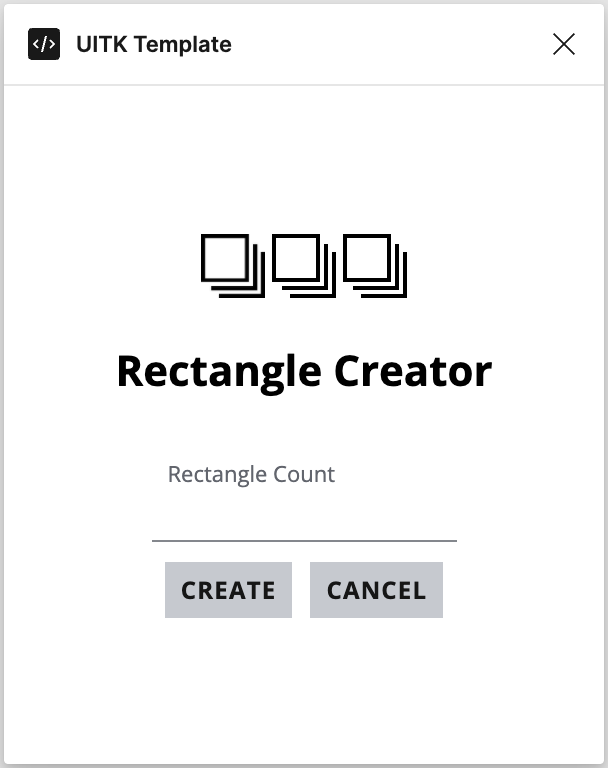

Figma Plugin Template with jest set up and post message TypeScript types set up, and uses [uitk](https://github.com/jpmorganchase/uitk) React components.

Based on [React Vite](https://github.com/origami-z/figma-react-vite-template) template.
